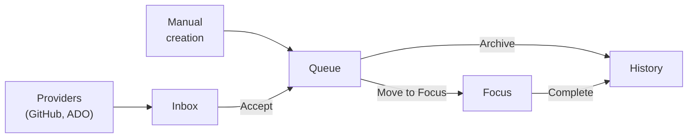

# DevDocket

<p align="center">
  
</p>

**A unified work hub inside VS Code.**

DevDocket is a VS Code extension that brings all of your work items — GitHub issues, Azure DevOps work items, PR review requests, and ad-hoc tasks — into a single, organized sidebar. Instead of juggling browser tabs, notification emails, and sticky notes, you manage everything from where you already write code.

## Why DevDocket?

Developers constantly context-switch between tools. Issues live in GitHub, tasks live in Azure DevOps, review requests arrive by email, and ad-hoc follow-ups exist only in your head. DevDocket is **not** a replacement for any of these — it's an **aggregation layer** that gives you a personal, unified view of your work inside VS Code.

- **Providers** discover items from external sources (GitHub, Azure DevOps, and more) and surface them automatically.
- **You** decide what to accept, what to dismiss, and what to work on next.
- **Actions** automate workflows — like creating a branch and worktree for a work item with one click.

## Workflow

DevDocket organizes work across five views in the sidebar:



| View | Purpose |
|------|---------|
| **Inbox** | Newly discovered items from providers. Accept to keep, or dismiss. |
| **Queue** | Your curated backlog — accepted items and manual tasks. |
| **Focus** | What you're actively working on. Pause or complete items here. |
| **History** | Completed and archived items — your work record. |
| **Sources** | Everything providers know about, browsable anytime. |

Provider-linked items are automatically marked **Done** when their issue or PR is closed externally.

For detailed view behavior, keyboard shortcuts, and configuration options, see the [UX Guide](docs/ux-guide.md).

## Installation

DevDocket is not yet available on the VS Code Marketplace. To run it, build from source:

1. **Clone the repository:**
   ```bash
   git clone https://github.com/devdocket/devdocket.git
   cd devdocket
   ```

2. **Install dependencies and build:**
   ```bash
   npm install
   npm run build
   ```

3. **Run in VS Code** — open the repo in VS Code and press **F5** to launch the Extension Development Host with DevDocket loaded.

4. **Package for local install** (optional):
   ```bash
   cd packages/core
   npx @vscode/vsce package
   ```
   Run this from each extension folder you want to package (e.g., `packages/core`, `packages/github`). This produces a `.vsix` file you can install via **Extensions → ⋯ → Install from VSIX…** in VS Code.

## Plugin Ecosystem

DevDocket is extensible with two types of plugins:

| Type | Description |
|------|-------------|
| **Providers** | Discover work items from external sources and surface them in DevDocket. |
| **Actions** | Operations that run on a work item (e.g., create a branch, run AI code review). |

**Included extensions:**

| Extension | Type | What It Does |
|-----------|------|--------------|
| DevDocket GitHub | Provider | Discovers GitHub issues and PR review requests |
| DevDocket ADO | Provider | Discovers Azure DevOps work items and PR review requests |
| Start Git Work | Action | Creates a branch and worktree for a work item |
| AI Code Review | Action | Analyzes diffs using an AI model and posts review comments |

To build your own provider or action, see the [Extension API documentation](docs/extension-api.md).

## Architecture

DevDocket is a monorepo with five VS Code extensions and a shared library:

```
packages/
├── core/              # The hub extension (UI, lifecycle, plugin API)
├── github/            # GitHub issues and PR review provider
├── ado/               # Azure DevOps work items and PR review provider
├── start-git-work/    # Branch + worktree action
├── ai-reviewer/       # AI code review action
└── shared/            # Shared library (BaseProvider, utilities)
```

## Documentation

| Document | Description |
|----------|-------------|
| [UX Guide](docs/ux-guide.md) | Views, data flow, configuration, keyboard shortcuts |
| [Extension API](docs/extension-api.md) | Provider and action contracts, interfaces, examples |
| [Provider Discovery](docs/provider-discovery.md) | What causes items to appear in each provider |

## Contributing

1. Fork the repository and create a branch from `dev`.
2. Install dependencies: `npm install`
3. Build all packages: `npm run build`
4. Run tests: `npm run test`
5. Open a pull request targeting the `dev` branch.

The default branch is **`dev`** — all work should be based from and merged back to `dev`.

## License

[MIT](LICENSE) © Matt Thalman
