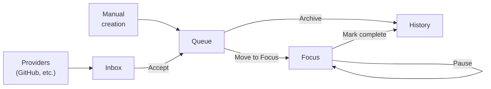

# WorkCenter

**A unified work hub inside VS Code.**

WorkCenter is a VS Code extension that brings all of your work items — GitHub issues, Azure DevOps work items, PR review requests, investigations, follow-ups, and ad-hoc tasks — into a single, organized sidebar. Instead of juggling browser tabs, notification emails, and sticky notes, you manage everything from where you already write code.

## The Problem

Developers constantly context-switch between tools. Issues live in GitHub, tasks live in Jira, review requests arrive by email, and ad-hoc follow-ups exist only in your head. Each tool has its own UI, its own notification model, and its own idea of "what's next." The result: work falls through the cracks, and you waste time just figuring out what to do.

## How WorkCenter Helps

WorkCenter is **not** a replacement for GitHub Issues, Jira, or any other system of record. It is an **aggregation layer** that sits inside VS Code and gives you a personal, unified view of your work:

- **Providers** discover items from external sources (GitHub issues, Azure DevOps work items, PR reviews, and more in the future) and surface them automatically.
- **You** decide what to accept, what to dismiss, and what to work on next.
- **Actions** let provider extensions automate workflows — like creating a branch and worktree for a GitHub issue with one click.

## Quick Start

1. **Install WorkCenter** from the VS Code marketplace (`mthalman.workcenter`).
2. **Install a provider** — for example, WorkCenter GitHub (`mthalman.workcenter-github`) to discover GitHub issues and PR review requests.
3. **Open the WorkCenter sidebar** by clicking the WorkCenter icon in the activity bar.
4. **Check your Inbox** — newly discovered items from providers appear here. Accept items to add them to your Queue, or dismiss them. Some providers may re-surface dismissed items if they remain relevant.
5. **Work your Queue** — move items to Focus when you're ready to start, or create manual items with the ➕ button.
6. **Stay focused** — the Focus view shows only what you're actively working on. Pause items or mark them complete as you go.

### Configuring the GitHub Provider

After installing WorkCenter GitHub, configure which repositories to watch for issues:

```jsonc
// settings.json
{
  "workcenterGithub.repos": ["owner/repo1", "owner/repo2"],
  "workcenterGithub.refreshIntervalSeconds": 300
}
```

Leave `repos` empty to fetch all issues assigned to you across all repositories.

> **Note:** The `repos` setting scopes both **issue discovery and PR review discovery**. When `repos` is empty, both fall back to global discovery (all issues assigned to you and all PRs where your review is requested, across all repositories).

## The Five-View Model

WorkCenter organizes work across five views in the sidebar:

### Inbox

Newly discovered items from providers that you haven't acted on yet. Each provider's items are grouped under the provider name. Accept items to move them to your Queue, or dismiss them to hide them from the Inbox; depending on the provider, dismissed items may later reappear if they are resurfaced.

### Queue

Your curated backlog. Items arrive here when accepted from the Inbox or Sources, or when you create them manually. From here, move items to Focus when you're ready to start working on them, or archive them to skip.

### Focus

Your active work. Items here are things you're actively working on or paused. The Focus view is designed to show only what matters right now. Mark items complete when you're done, or pause them to signal status at a glance.

### History

Completed and archived items. The History view gives you a record of finished work — useful for standups, status updates, and recalling what you've done.

### Sources

A browsable library of everything providers know about, organized by provider and sub-group (e.g., repository name). Items show whether you've already acted on them — accepted items display a ✓ icon, dismissed items show a label. You can accept items into your Queue directly from Sources at any time.

### Data Flow



> **Note:** Items in History are a read-only record of completed or archived work. You can open their links (when available), but they can't currently be moved back to Queue or Focus.

## Plugin Ecosystem

WorkCenter is built around an extensible plugin model with two extension points:

### Providers

A provider discovers work items from an external source and reports them to WorkCenter. The core extension handles all UI — providers just emit data.

**Built-in providers:**

| Provider | What It Discovers |
|----------|-------------------|
| **GitHub Issues** | Issues assigned to you in configured repositories |
| **GitHub PR Reviews** | Pull requests where your review is requested |
| **ADO Work Items** | Azure DevOps work items assigned to you |
| **ADO PR Reviews** | Azure DevOps pull requests where your review is requested |

### Actions

An action is an operation that runs on a work item. Actions appear in the **Run Action…** menu on Queue and Focus items.

**Built-in actions:**

| Action | Description |
|--------|-------------|
| **Start Work (Branch + Worktree)** | Creates a git branch and worktree for a GitHub issue, then opens a new VS Code window |
| **AI Code Review** | Analyzes the current diff using an AI model and posts review comments |

### Building Your Own

Provider and action extensions use a simple, well-defined API surface. See the [Extension API documentation](docs/extension-api.md) for the full contract, interfaces, and example implementations.

## Architecture

WorkCenter is a monorepo with four VS Code extensions and a shared library:

```
packages/
├── core/          # WorkCenter — the hub extension (UI, lifecycle, plugin API)
├── github/        # WorkCenter GitHub — provider for GitHub issues and PR reviews
├── ado/           # WorkCenter ADO — provider for Azure DevOps work items and PR reviews
├── ai-reviewer/   # AI code review action extension
└── shared/        # Shared library (BaseProvider, URL validation, logger, refresh interval)
```

- **`packages/core`** owns the five views, work item persistence, the editor panel, and the extension API (`WorkCenterApi`).
- **`packages/github`** is a provider extension that discovers GitHub issues and PR reviews, and offers a "Start Work" action.
- **`packages/ado`** is a provider extension that discovers Azure DevOps work items and PR reviews.
- **`packages/ai-reviewer`** is an action extension that analyzes diffs using an AI model and posts review comments.
- **`packages/shared`** contains the `BaseProvider` base class for consistent provider lifecycle management (periodic refresh, concurrency guards, disposal), URL validation helpers, a logger service, and refresh interval validation.

Provider extensions extend `BaseProvider` from `@workcenter/shared` and depend on the core extension via `extensionDependencies`, acquiring the API at activation time. They do not import code from the core package directly — interfaces are re-declared to keep the extensions decoupled.

### Data Storage

WorkCenter persists two JSON files in VS Code's `globalStorageUri`:

- **`workitems.json`** — All accepted and manual work items with their lifecycle state, including the persisted fields WorkCenter stores at creation/accept time, such as the work item `title`, optional `url`, provider provenance (`providerId` and `externalId`), and any `notes`. Provider-derived values captured at accept time may become stale compared to live data from the provider.
- **`discovered-state.json`** — A thin index tracking whether each discovered item has been accepted, dismissed, or not yet seen. This file does not store provider item fields; for inbox items, provider data is read live from the provider.

## Documentation

- [UX Guide](https://github.com/mthalman/workcenter/pull/28) — The five views, data flow, work item states, available actions, and the editor panel. *(Added by [PR #28](https://github.com/mthalman/workcenter/pull/28); docs file will be available at `docs/ux-guide.md` once merged.)*
- [Extension API](docs/extension-api.md) — Provider and action contracts, interfaces, and example implementations.

## Contributing

1. Fork the repository and create a branch from `dev`.
2. Install dependencies: `npm install`
3. Build all packages: `npm run build`
4. Run tests: `npm run test`
5. Open a pull request targeting the `dev` branch.

The default branch is **`dev`** — all work should be based from and merged back to `dev`.

## License

[MIT](LICENSE) © Matt Thalman
