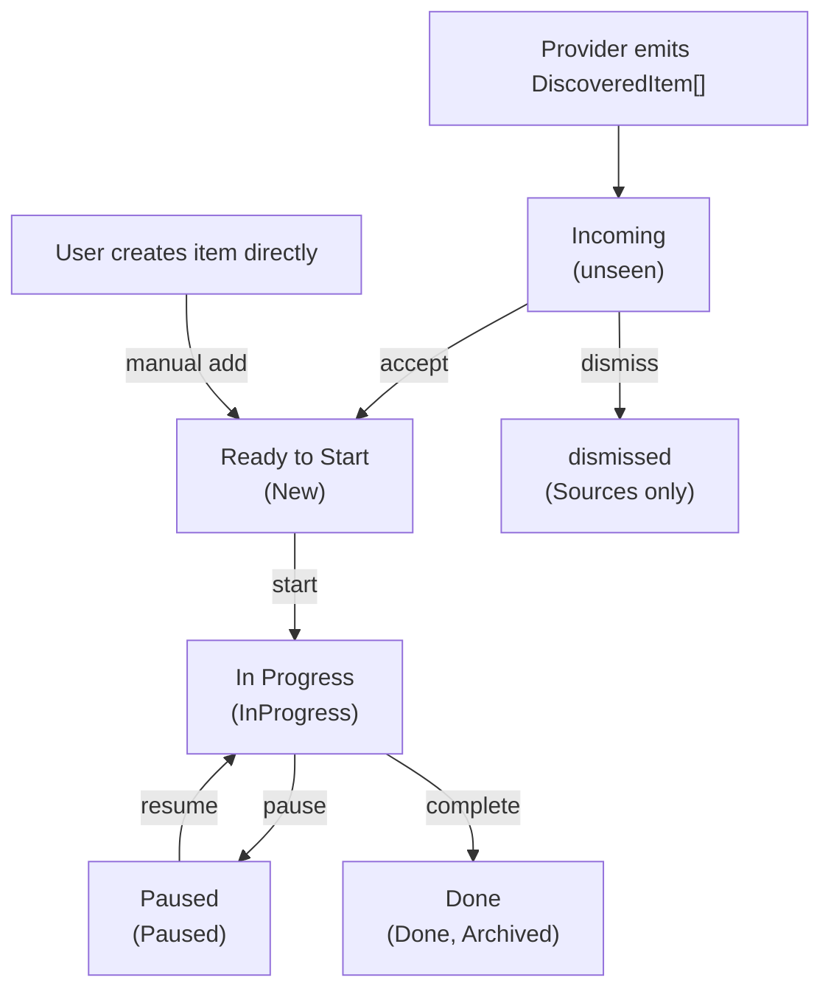

# DevDocket Provider API Guide

DevDocket is a VS Code extension that acts as a central hub for managing work items from multiple sources. Third-party extensions integrate with DevDocket by registering **providers** (to discover items from external systems) and **actions** (to add capabilities that operate on work items).

This guide walks through the API surface and shows how to build a provider extension from scratch.

## Table of Contents

- [Overview](#overview)
- [Getting Started](#getting-started)
- [Implementing a Provider](#implementing-a-provider)
- [Implementing an Action](#implementing-an-action)
- [Data Flow](#data-flow)
- [Best Practices](#best-practices)
- [API Reference](#api-reference)

---

## Overview

DevDocket organizes work items through a lifecycle, surfaced as tiers in the **My Work** tab of the DevDocket sidebar plus a separate **Sources** tab:

| Tier | Purpose |
|------|---------|
| **Incoming** | Newly discovered provider items the user hasn't triaged yet |
| **In Progress** | Items the user is actively working on |
| **Ready to Start** | The user's curated backlog of accepted items |
| **Paused** | Items the user has temporarily set aside |
| **Done** | Completed and archived items |
| **Sources** (separate tab) | A browsable library of everything providers know about |

**Providers** feed items into this system by emitting `DiscoveredItem` arrays. For discovery surfaces (the **Incoming** tier and the **Sources** tab), item data is read live from the provider. When a user accepts an item, DevDocket stores a snapshot of it as a `WorkItem`, and the **In Progress / Ready to Start / Paused / Done** tiers render that persisted data instead of always reading live from the provider.

**Actions** extend what users can do with work items. The editor's `Run Action…` button exposes the available actions for the current item, filtered via a `canRun()` predicate.

---

## Getting Started

### 1. Declare the Extension Dependency

Add DevDocket as an extension dependency in your `package.json` so VS Code activates it before your extension:

```jsonc
// package.json
{
  "extensionDependencies": ["mthalman.devdocket"]
}
```

### 2. Acquire the API

In your extension's `activate()` function, get the `DevDocketApi` from the core extension:

```ts
import * as vscode from 'vscode';

export async function activate(context: vscode.ExtensionContext): Promise<void> {
  const coreExtension = vscode.extensions.getExtension('mthalman.devdocket');
  if (!coreExtension) {
    vscode.window.showErrorMessage(
      'DevDocket core extension not found. Install "mthalman.devdocket".'
    );
    return;
  }

  // eslint-disable-next-line @typescript-eslint/no-explicit-any -- VS Code's exports/activate() returns any
  let api: any;
  try {
    api = coreExtension.isActive
      ? coreExtension.exports
      : await coreExtension.activate();
  } catch (err: unknown) {
    const message = err instanceof Error ? err.message : String(err);
    vscode.window.showErrorMessage(
      `Failed to activate DevDocket: ${message}`
    );
    return;
  }

  if (
    !api ||
    typeof api.registerProvider !== 'function' ||
    typeof api.registerAction !== 'function'
  ) {
    vscode.window.showErrorMessage(
      'DevDocket API is unavailable or invalid. Update "mthalman.devdocket".'
    );
    return;
  }

  // api is a DevDocketApi — register providers and actions here
}
```

### 3. Install `@devdocket/shared` (recommended) or re-declare types

The `@devdocket/shared` package provides the TypeScript types and the `BaseProvider` base class needed to build providers and actions with full type safety. It is published to the GitHub Packages npm registry — see [the Extension API guide](./extension-api.md#installing-devdocketshared) for the `.npmrc` setup and authentication notes.

```ts
import { BaseProvider, type DiscoveredItem } from '@devdocket/shared';
```

If you would rather avoid the GitHub Packages dependency, you can re-declare the small subset of interfaces your extension needs. Copy the following declarations into your provider code:

```ts
interface Disposable {
  dispose(): void;
}

interface Event<T> {
  (listener: (e: T) => void): Disposable;
}

interface DiscoveredItem {
  externalId: string;
  title: string;
  description?: string;
  url?: string;
  group?: string;
  canonicalId?: string;
  itemType?: 'issue' | 'pr';
  badges?: ProviderBadge[];
  /** Opaque "soft" version token. See provider-discovery.md#resurfacing. */
  version?: string;
  /** Opaque "always-resurface" token. See provider-discovery.md#resurfacing. */
  resurfaceVersion?: string;
}

interface DevDocketProvider {
  readonly id: string;
  readonly label: string;
  readonly onDidDiscoverItems: Event<DiscoveredItem[]>;
  refresh(token?: vscode.CancellationToken): Promise<void>;
  resolveUrl?(url: string, signal?: AbortSignal): Promise<ResolvedItem | undefined>;
  getClosedItems?(externalIds: string[], signal?: AbortSignal): Promise<string[]>;
}

interface ResolvedItem {
  title: string;
  notes: string;
  url: string;
  externalId: string;
  group?: string;
  providerId: string;
}
```

---

## Implementing a Provider

A provider discovers items from an external source and reports them to DevDocket via an event emitter.

### Full Example

```ts
import * as vscode from 'vscode';

interface DiscoveredItem {
  externalId: string;
  title: string;
  description?: string;
  url?: string;
  group?: string;
  canonicalId?: string;
  itemType?: 'issue' | 'pr';
  badges?: ProviderBadge[];
}

interface Disposable {
  dispose(): void;
}

interface Event<T> {
  (listener: (e: T) => void): Disposable;
}

interface DevDocketProvider {
  readonly id: string;
  readonly label: string;
  readonly onDidDiscoverItems: Event<DiscoveredItem[]>;
  refresh(token?: vscode.CancellationToken): Promise<void>;
  resolveUrl?(url: string, signal?: AbortSignal): Promise<ResolvedItem | undefined>;
  getClosedItems?(externalIds: string[], signal?: AbortSignal): Promise<string[]>;
}

interface ResolvedItem {
  title: string;
  notes: string;
  url: string;
  externalId: string;
  group?: string;
  providerId: string;
}

class JiraProvider implements DevDocketProvider {
  readonly id = 'jira';
  readonly label = 'Jira Issues';

  // Use vscode.EventEmitter to implement the onDidDiscoverItems event
  private readonly _onDidDiscoverItems =
    new vscode.EventEmitter<DiscoveredItem[]>();
  readonly onDidDiscoverItems = this._onDidDiscoverItems.event;

  private refreshTimer: ReturnType<typeof setInterval> | undefined;
  private _isRefreshing = false;

  async refresh(token?: vscode.CancellationToken): Promise<void> {
    const tickets = await this.fetchTickets();

    const items: DiscoveredItem[] = tickets.map((ticket) => ({
      // externalId must be unique within this provider and stable across refreshes
      externalId: `${ticket.project}/${ticket.key}`,
      title: `${ticket.key}: ${ticket.summary}`,
      description: ticket.description?.slice(0, 200),
      url: `https://jira.example.com/browse/${ticket.key}`,
      // group organizes items under folders in the Sources tab
      // and shows as the repo annotation under each item card
      group: ticket.project,
      // itemType drives the Issue/PR pill rendered by core in both views.
      // Omit it for heterogeneous or generic sources.
      itemType: 'issue',
      // badges are provider-declared pills; core never infers them from
      // state/reason strings. Use `show: 'editor'` for verbose state labels
      // that would clutter the sidebar.
      badges: [
        { label: 'Assigned to me', variant: 'warning' },
        { label: ticket.status, variant: 'info', show: 'editor' },
      ],
    }));

    // Each emission replaces the provider's entire item set
    this._onDidDiscoverItems.fire(items);
  }

  /** Start a periodic refresh on a timer. */
  startPeriodicRefresh(intervalSeconds: number): void {
    this.stopPeriodicRefresh();
    const safeIntervalSeconds = Number.isFinite(intervalSeconds)
      ? intervalSeconds
      : 60;
    const interval = Math.max(safeIntervalSeconds, 60) * 1000;
    this.refreshTimer = setInterval(() => {
      if (this._isRefreshing) {
        return; // Skip if a refresh is already in progress
      }
      this._isRefreshing = true;
      this.refresh()
        .catch((err) => console.error('Jira refresh failed', err))
        .finally(() => { this._isRefreshing = false; });
    }, interval);
  }

  stopPeriodicRefresh(): void {
    if (this.refreshTimer) {
      clearInterval(this.refreshTimer);
      this.refreshTimer = undefined;
    }
  }

  dispose(): void {
    this.stopPeriodicRefresh();
    this._onDidDiscoverItems.dispose();
  }

  // Optional: support "Create Item from URL" for Jira ticket URLs
  async resolveUrl(url: string): Promise<ResolvedItem | undefined> {
    const match = url.match(/\/browse\/(([A-Z]+)-(\d+))$/);
    if (!match) { return undefined; }
    const [, key, project] = match;
    const ticket = await this.fetchTicket(key);
    if (!ticket) { return undefined; }
    return {
      title: `${key}: ${ticket.summary}`,
      notes: ticket.description ?? '',
      url,
      externalId: `${project}/${key}`,
      group: project,
      providerId: this.id,
    };
  }

  // Optional: support auto-completion when external items are closed
  async getClosedItems(
    externalIds: string[],
    signal?: AbortSignal,
  ): Promise<string[]> {
    // Batch-check which items are closed/resolved in Jira
    const statuses = await this.fetchStatuses(externalIds, signal);
    return statuses
      .filter((s) => s.isClosed)
      .map((s) => s.externalId);
  }

  private async fetchStatuses(
    _externalIds: string[],
    _signal?: AbortSignal,
  ): Promise<Array<{ externalId: string; isClosed: boolean }>> {
    // Replace with your actual API call — batch where possible
    return [];
  }

  private async fetchTicket(_key: string): Promise<
    { summary: string; description?: string } | undefined
  > {
    // Replace with your actual API call
    return undefined;
  }

  private async fetchTickets(): Promise<
    Array<{
      key: string;
      project: string;
      summary: string;
      description?: string;
    }>
  > {
    // Replace with your actual API call
    return [];
  }
}
```

### Key Points

- **EventEmitter pattern** — Use `vscode.EventEmitter<DiscoveredItem[]>` to create the event. Expose its `.event` property as the readonly `onDidDiscoverItems`.
- **`refresh()` is called by DevDocket** — It is invoked automatically when the provider is registered for initial discovery. It must be safe to call multiple times. DevDocket passes a `CancellationToken` and enforces a refresh timeout; providers should check `token.isCancellationRequested` before and during long-running operations.
- **`externalId` must be unique per provider** — DevDocket uses the combination of `providerId + externalId` to track inbox state. Use a stable identifier like `owner/repo#123` or `PROJECT/TICKET-42`.
- **`group` is optional** — When set, items with the same group value are nested under a folder node in the Sources tab and surfaced as a small annotation below the title on each item card.
- **`resolveUrl()` is optional** — Implement it to let users create work items by pasting a URL (e.g. from a browser). When the user runs the "Create Item from URL" command, DevDocket asks each registered provider to resolve the URL. The first provider that returns a `ResolvedItem` wins. If your provider doesn't recognise the URL, return `undefined`.
- **`getClosedItems()` is optional** — Implement it to enable auto-completion of work items when their linked external item is closed or merged. After each provider refresh, DevDocket collects all work items in the WorkGraph linked to your provider (including manually-imported items) and calls `getClosedItems()` with their external IDs. Return the subset that are closed, merged, or completed. Providers without this method fall back to **disappearance detection** — if a previously-discovered item is absent from the next refresh, it is assumed closed. The disappearance fallback cannot cover manually-imported items since the provider never discovered them. Auto-completion is controlled by the `devDocket.autoCompleteOnClose` setting (default: `true`).
- **Emit the full set every time** — Each `onDidDiscoverItems` emission replaces all previously known items for that provider. Emit everything currently relevant, not just deltas.

### Periodic Refresh Pattern

For providers that poll an external API, set up a `setInterval` timer. Clamp the interval to a reasonable minimum (e.g., 60 seconds) and guard against overlapping refreshes.

The `@devdocket/shared` package provides a `validateRefreshInterval(value, logger?)` helper that validates and clamps user-configured intervals. It handles non-numeric values, enforces a 60-second minimum, and returns 0 (disabled) for zero/negative input:

```ts
import { validateRefreshInterval } from '@devdocket/shared';

const config = vscode.workspace.getConfiguration('myExtension');
const intervalSeconds = validateRefreshInterval(
  config.get<number>('refreshIntervalSeconds', 300), logger,
);
provider.startPeriodicRefresh(intervalSeconds);
```

Typical refresh guard pattern:

```ts
private _isRefreshing = false;

private async refreshInBackground(): Promise<void> {
  if (this._isRefreshing) {
    return; // Skip if a refresh is already in progress
  }

  this._isRefreshing = true;
  try {
    await this.refresh();
  } finally {
    this._isRefreshing = false;
  }
}
```

### Registering the Provider

```ts
export async function activate(context: vscode.ExtensionContext): Promise<void> {
  // ... acquire api (see Getting Started) ...

  const provider = new JiraProvider();
  provider.startPeriodicRefresh(300); // every 5 minutes

  // registerProvider returns a Disposable — push it for cleanup
  const registration = api.registerProvider(provider);
  context.subscriptions.push(registration);

  // The provider owns its own resources (timer, emitter) — dispose separately
  context.subscriptions.push({ dispose: () => provider.dispose() });

  // No need to call provider.refresh() manually — registerProvider triggers
  // initial discovery automatically.
}
```

---

## Implementing an Action

An action is an operation users can perform on a work item. Actions appear dynamically as the **Run Action…** button in the work item editor (when the open item satisfies the action's `canRun(item)` predicate).

### Full Example

```ts
import * as vscode from 'vscode';

enum WorkItemState {
  New = 'New',
  InProgress = 'InProgress',
  Paused = 'Paused',
  Done = 'Done',
  Archived = 'Archived',
}

interface WorkItem {
  id: string;
  title: string;
  notes?: string;
  state: WorkItemState;
  providerId?: string;
  externalId?: string;
  url?: string;
  sortOrder?: number;
  createdAt: number;
  updatedAt: number;
}

interface DevDocketAction {
  readonly id: string;
  readonly label: string;
  canRun(item: WorkItem): boolean;
  run(item: WorkItem): Promise<void>;
}

class CreateBranchAction implements DevDocketAction {
  readonly id = 'jira.createBranch';
  readonly label = 'Create Feature Branch';

  canRun(item: WorkItem): boolean {
    // Only show for Jira items that are new (not yet started)
    return item.providerId === 'jira' && item.state === WorkItemState.New;
  }

  async run(item: WorkItem): Promise<void> {
    if (!item.externalId) {
      vscode.window.showErrorMessage('No external ID found for this item.');
      return;
    }

    const branchName = `feature/${item.externalId.replace(/\//g, '-')}`;
    // ... create git branch, open worktree, etc.
    vscode.window.showInformationMessage(`Created branch: ${branchName}`);
  }
}
```

### Key Points

- **`canRun(item)`** — Called each time the user opens the Run Action menu. Return `true` to show the action for that item. Filter by `providerId`, `state`, or any other `WorkItem` field.
- **`run(item)`** — Executes the action. Throw an error (or show a message via `vscode.window`) to report failures.
- **Actions are provider-agnostic by default** — An action can apply to items from any provider. Use `item.providerId` in `canRun()` to scope it to a specific provider.

### Registering the Action

```ts
const action = new CreateBranchAction();
context.subscriptions.push(api.registerAction(action));
```

---

## Data Flow

Understanding how items move through DevDocket helps you build effective providers.



### What gets persisted

DevDocket maintains two records in VS Code `globalState`:

| `globalState` key | Contents |
|-------------------|----------|
| `devdocket.workitems` | Full `WorkItem` records with state machine lifecycle |
| `devdocket.discovered-state` | Thin index mapping `providerId + externalId` → inbox state (`unseen`, `accepted`, `dismissed`) |

**`DiscoveredItem` fields are not persisted in `devdocket.discovered-state`.** That key stores only inbox state keyed by `providerId + externalId`, which keeps the discovery index lightweight.

When a user **accepts** an item from the Incoming tier or Sources tab, DevDocket creates a new `WorkItem` (under `devdocket.workitems`) using provider-backed data (such as title and URL) along with provenance metadata (`providerId`, `externalId`). Some fields may be normalized during acceptance — for example, grouped items have the group name prefixed to the stored title.

---

## Best Practices

### Use unique, stable external IDs

The `externalId` is the primary key DevDocket uses (together with `providerId`) to track inbox state. It must be:
- **Unique** within your provider
- **Stable** across refreshes — the same real-world item must always produce the same `externalId`
- **Deterministic** — avoid random suffixes or timestamps

Good patterns: `owner/repo#123`, `PROJECT-42`, `ticket/12345`

### Keep refresh lightweight

`refresh()` is called on registration, and may also run frequently if your provider schedules periodic refreshes with a timer. Avoid heavy processing:
- Cache API responses where appropriate
- Guard against overlapping refreshes with a boolean flag
- Clamp periodic intervals to a reasonable minimum (≥ 60 seconds)

### Don't store provider item data

DevDocket reads `DiscoveredItem` data live from the provider. There is no need to persist item details on your side — just emit the current set on each refresh. This ensures discovery surfaces (the Incoming tier and the Sources tab) show the latest provider data, while accepted items in the Ready to Start / In Progress / Paused / Done tiers continue to display their persisted `WorkItem` snapshots.

### Dispose subscriptions properly

- Push the `Disposable` returned by `registerProvider()` / `registerAction()` into `context.subscriptions`
- Provider resources (timers, event emitters) are **not** disposed by DevDocket — clean them up yourself
- Use a `dispose()` method on your provider class and push it into `context.subscriptions`

```ts
context.subscriptions.push(api.registerProvider(provider));
context.subscriptions.push({ dispose: () => provider.dispose() });
```

### Emit the complete item set

Each `onDidDiscoverItems` emission **replaces** the provider's entire known item set. Always emit all current items, not incremental changes.

### Use `group` for organization

Set the `group` field on `DiscoveredItem` to organize items under folder nodes in the Sources tab and to display as a sub-annotation under each item card. For example, a GitHub provider groups issues by repository name.

### Classify items with `itemType`

Set `itemType` to `'issue'` or `'pr'` when your provider knows the kind of item it's surfacing. DevDocket renders this as a dedicated Issue/PR pill alongside the provider, state, and CI badges.

- **Do** set `itemType` from authoritative provider data (e.g. an API field, the URL pattern of the source, or a dedicated endpoint).
- **Don't** make consumers of `DiscoveredItem` infer the kind from URLs or state strings — only the provider has authoritative knowledge of what it actually fetched.
- **Leave `itemType` undefined** for generic / heterogeneous sources where the kind isn't meaningful (e.g. a "starred items" feed). The pill simply won't render.

### Declare badges explicitly

DevDocket itself owns three badge categories: **Provider** (GitHub / ADO / Manual), **Type** (Issue / PR via `itemType`), and **CI** (from the watcher service). For everything else — state, review status, the reason an item showed up in the inbox — declare badges via `DiscoveredItem.badges`.

The core never infers badges from `state` or `reason` strings, so if you want a pill in the UI you must declare it explicitly.

**Variant → meaning:**

| Variant | Use for |
|---|---|
| `neutral` | Category labels (e.g. `Draft`) — outlined, no fill |
| `info` | Informational state (e.g. `Open`, `Review received`) — blue |
| `success` | Positive state (e.g. `Approved`, `Ready to merge`) — green |
| `warning` | Pending action (e.g. `Mentioned`, `Review requested`) — amber |
| `danger` | Action needed (e.g. `Changes requested`, `Rejected`) — red |

**`show` filter:** Defaults to `'both'`. Use `show: 'editor'` for verbose state labels that would clutter the sidebar (e.g. a custom workflow state). Use `show: 'sidebar'` for the rare badge that's only useful during inbox triage.

```ts
badges: [
  // Reason badge tells the user why this item surfaced.
  { label: 'Mentioned', variant: 'warning' },
  // Verbose upstream state that should only show in the editor.
  { label: 'In Review', variant: 'info', show: 'editor' },
],
```

When adding a new provider, default to declaring **at least** one reason badge (e.g. `'Mentioned'`, `'Review requested'`) plus a state badge with `show: 'editor'` so users can see *why* the item appeared and what the upstream state is in the editor.

### Use `canonicalId` for cross-provider deduplication

When the same underlying entity (e.g., a pull request) might be discovered by multiple providers, set `canonicalId` to a shared identifier so DevDocket can deduplicate them in the Incoming tier.

**How it works:**
- Items from different providers that share the same `canonicalId` are grouped in the Incoming tier, and only one representative item is shown.
- When the user accepts, dismisses, or reads an item, the action propagates to all items in the group.
- Items without `canonicalId` always show individually — existing providers are unaffected.
- The Sources tab is not affected by `canonicalId` — it continues to show items per provider.

**Format convention:** Use a consistent, deterministic format so that independent providers generate the same `canonicalId` for the same entity. The recommended pattern is `<platform>:<entity-type>:<identifier>`:

| Entity | Example `canonicalId` |
|--------|----------------------|
| GitHub PR | `github:pull:octocat/hello-world#42` |
| GitHub Issue | `github:issue:octocat/hello-world#7` |
| ADO PR | `ado:pull:myorg/myproject/myrepo#123` |

**When to use it:** If your provider discovers items that another provider might also discover, set `canonicalId`. For example, a "My PRs" provider and a "PR Reviews" provider may both discover the same pull request — giving both items the same `canonicalId` ensures the user sees it only once in their Incoming tier.

---

## API Reference

### `DevDocketApi`

The entry point returned by the core extension's `activate()` / `exports`.

```ts
interface DevDocketApi {
  /**
   * Register a provider that discovers items from an external source.
   * DevDocket calls provider.refresh() immediately upon registration.
   * @returns A Disposable that unregisters the provider when disposed.
   */
  registerProvider(provider: DevDocketProvider): Disposable;

  /**
   * Register an action that can be performed on work items.
   * Actions appear in the "Run Action…" quick pick menu.
   * @returns A Disposable that unregisters the action when disposed.
   */
  registerAction(action: DevDocketAction): Disposable;
}
```

### `DevDocketProvider`

Implemented by extensions that discover items from an external source.

```ts
interface DevDocketProvider {
  /** Unique identifier for this provider (e.g., 'github', 'jira'). */
  readonly id: string;

  /** Human-readable label shown in the UI (e.g., 'GitHub Issues'). */
  readonly label: string;

  /**
   * Event that fires when the provider has items to report.
   * Each emission replaces the provider's entire item set.
   */
  readonly onDidDiscoverItems: Event<DiscoveredItem[]>;

  /**
   * Called by DevDocket on registration for initial discovery.
   * Must be safe to call multiple times. Providers should honor
   * the cancellation token when practical — DevDocket enforces
   * a refresh timeout and cancels the token if the provider takes
   * too long.
   */
  refresh(token?: vscode.CancellationToken): Promise<void>;

  /**
   * Attempt to resolve a URL into an item this provider can manage.
   * Return a ResolvedItem if the URL matches a pattern your provider
   * owns (e.g. a GitHub issue URL), or undefined if not recognised.
   * Optional — providers that don't support URL import omit this.
   *
   * @param url - The raw URL entered by the user.
   * @param signal - Optional AbortSignal for cancellation.
   */
  resolveUrl?(url: string, signal?: AbortSignal): Promise<ResolvedItem | undefined>;

  /**
   * Check which of the given external items have been closed or completed.
   * Called after each provider refresh to auto-complete linked work items,
   * including manually-imported items that may not appear in the provider's
   * discovered-items list.
   * Optional — providers without this method fall back to disappearance
   * detection (item was previously discovered but is now absent).
   *
   * @param externalIds - The provider-scoped external IDs to check.
   * @param signal - Optional AbortSignal for cancellation.
   * @returns The subset of externalIds that are closed, merged, or completed.
   */
  getClosedItems?(externalIds: string[], signal?: AbortSignal): Promise<string[]>;
}
```

### `ResolvedItem`

Returned by `resolveUrl()` when a provider recognises a URL. Contains enough detail for DevDocket to create a work item.

```ts
interface ResolvedItem {
  /** Display title for the work item (e.g. '#42: Fix login bug'). */
  title: string;

  /** Body or description to store as the work item's notes. */
  notes: string;

  /** URL linking back to the item in the source system. */
  url: string;

  /** Provider-scoped unique ID for deduplication (e.g. 'owner/repo#42'). */
  externalId: string;

  /** Optional grouping key for UI organisation (e.g. 'owner/repo'). */
  group?: string;

  /** The provider ID that owns this item (typically `this.id`). */
  providerId: string;
}
```

### `DiscoveredItem`

Represents an item discovered by a provider.

```ts
interface DiscoveredItem {
  /**
   * Unique identifier within the provider. Must be stable across refreshes.
   * DevDocket uses providerId + externalId to track inbox state.
   */
  externalId: string;

  /** Title displayed in the Incoming tier and the Sources tab. */
  title: string;

  /** Optional description shown in tooltips. */
  description?: string;

  /** Optional URL for "Open in Browser" support. */
  url?: string;

  /**
   * Optional group name for sub-grouping in the Sources tab.
   * Items with the same group appear under a folder node, and the group
   * value is also rendered as a small annotation under each item card.
   */
  group?: string;

  /**
   * Optional cross-provider deduplication key.
   * When set, items from different providers that share the same canonicalId
   * are grouped in the Incoming tier and only one representative is shown.
   * Accept/dismiss/read-state actions propagate to all items in the group.
   * Items without canonicalId always show individually (backward compatible).
   *
   * Use a consistent format so different providers generate matching IDs
   * for the same entity (e.g., 'github:pull:owner/repo#42').
   */
  canonicalId?: string;

  /**
   * Optional classification of the item kind. DevDocket renders this as a
   * dedicated "Issue" or "PR" pill alongside the provider, state, and CI
   * badges. Set this when your provider knows the kind authoritatively;
   * leave it undefined for items that don't fit either category (e.g. plain
   * tickets from a generic source).
   *
   * Do NOT infer this in consumers from URL patterns or state strings —
   * only the provider knows what it actually fetched.
   */
  itemType?: 'issue' | 'pr';

  /**
   * Provider-declared badges shown alongside the core's Provider / Type / CI
   * badges. The core never infers badges from `state` or `reason` strings —
   * if you want a pill to surface in the UI, declare it explicitly here.
   */
  badges?: ProviderBadge[];

  /**
   * Optional opaque "soft" version token. When present, DevDocket re-marks
   * the item `unseen` on a value change — but only when the corresponding
   * work item is still in `New`. Use a stable opaque value (commit SHA,
   * ETag, updated_at). See `provider-discovery.md#resurfacing`.
   */
  version?: string;

  /**
   * Optional opaque "always-resurface" token. Behaves like `version` but
   * resurfaces regardless of work item state. Use for changes that
   * unconditionally warrant the user's attention.
   */
  resurfaceVersion?: string;
}

interface ProviderBadge {
  /** Display text. Keep short — sidebar badges compete with the title. */
  label: string;
  /**
   * Severity hint that drives color/treatment:
   *   - 'neutral' — outlined, no fill
   *   - 'info'    — blue
   *   - 'success' — green
   *   - 'warning' — amber
   *   - 'danger'  — red
   */
  variant: 'neutral' | 'info' | 'success' | 'warning' | 'danger';
  /** Defaults to 'both'. */
  show?: 'sidebar' | 'editor' | 'both';
}
```

### `DevDocketAction`

Implemented by extensions that add operations for work items.

```ts
interface DevDocketAction {
  /** Unique identifier for this action (e.g., 'github.startWork'). */
  readonly id: string;

  /** Human-readable label shown in the quick pick menu. */
  readonly label: string;

  /**
   * Returns true if this action applies to the given item.
   * Called each time the user opens the Run Action menu.
   */
  canRun(item: WorkItem): boolean;

  /**
   * Executes the action. Throw an error to surface it to the user.
   */
  run(item: WorkItem): Promise<void>;
}
```

### `WorkItem`

The persisted work item model passed to actions.

```ts
interface WorkItem {
  /** Internal unique ID generated by DevDocket. */
  id: string;

  /** User-visible title. */
  title: string;

  /** Optional user-added notes. */
  notes?: string;

  /** Provider-synced description (read-only mirror of the upstream description). */
  description?: string;

  /** Current state in the lifecycle. */
  state: WorkItemState;

  /** Provider ID if this item originated from a provider. */
  providerId?: string;

  /** External ID from the provider. */
  externalId?: string;

  /** URL associated with the item. */
  url?: string;

  /** Optional grouping key (e.g. repository name). */
  group?: string;

  /** Ordering hint for the Ready to Start tier. Managed by DevDocket. */
  sortOrder?: number;

  /** Timestamp (ms since epoch) when the item was created. */
  createdAt: number;

  /** Timestamp (ms since epoch) when the item was last updated. */
  updatedAt: number;

  /**
   * Append-only log of significant events (state transitions, action
   * invocations, version updates, etc.). Visible under the editor's
   * collapsible Activity Log section.
   */
  activityLog?: ActivityLogEntry[];
}
```

### `WorkItemState`

```ts
enum WorkItemState {
  New = 'New',               // Ready to Start tier — freshly created or accepted
  InProgress = 'InProgress', // In Progress tier — active work
  Paused = 'Paused',         // Paused tier — temporarily on hold
  Done = 'Done',             // Done tier — completed
  Archived = 'Archived',     // Done tier — archived (rendered alongside Done)
}
```

### `Disposable`

```ts
interface Disposable {
  /** Release resources held by this object. */
  dispose(): void;
}
```

### `Event<T>`

```ts
interface Event<T> {
  /**
   * Subscribe to this event.
   * @returns A Disposable that removes the listener when disposed.
   */
  (listener: (e: T) => void): Disposable;
}
```

---

## Further Reading

- [Extension API reference](./extension-api.md) — Detailed API walkthrough with additional examples
- [`packages/github`](../packages/github/src/) — Production provider implementation (GitHub Issues, PR reviews)
- [`packages/ado`](../packages/ado/src/) — Azure DevOps provider implementation (work items, PR reviews)
- [`packages/ai-reviewer`](../packages/ai-reviewer/src/) — Action-only extension that adds AI-powered code review for GitHub PR items
- [`packages/shared`](../packages/shared/src/) — Shared package published as `@devdocket/shared` to the GitHub Packages npm registry. Includes `BaseProvider` (an abstract base class that handles periodic refresh, concurrency guards, and disposal), `validateRefreshInterval`, URL validation, and logging utilities. See [the Extension API guide](./extension-api.md#installing-devdocketshared) for installation; the [Re-declare types](#3-install-devdocketshared-recommended-or-re-declare-types) section above shows the equivalent type declarations if you prefer to avoid the dependency.
