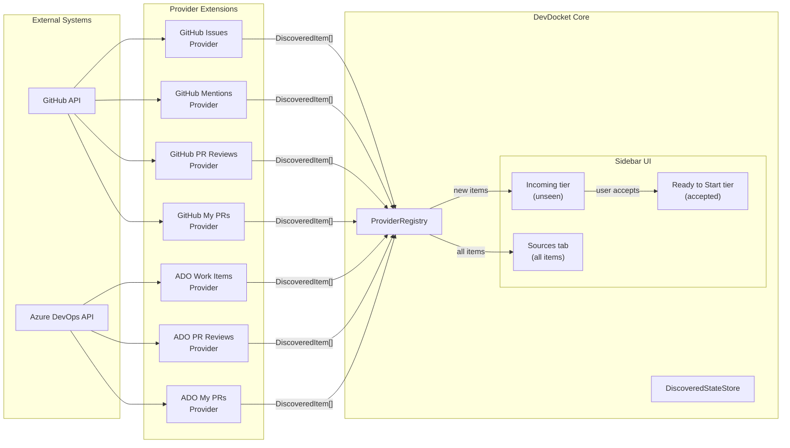
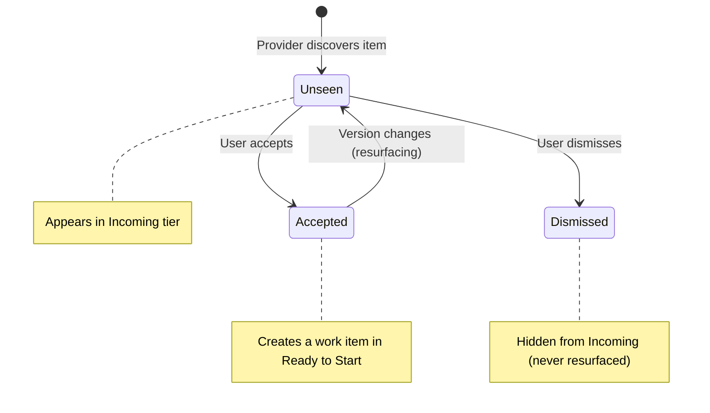
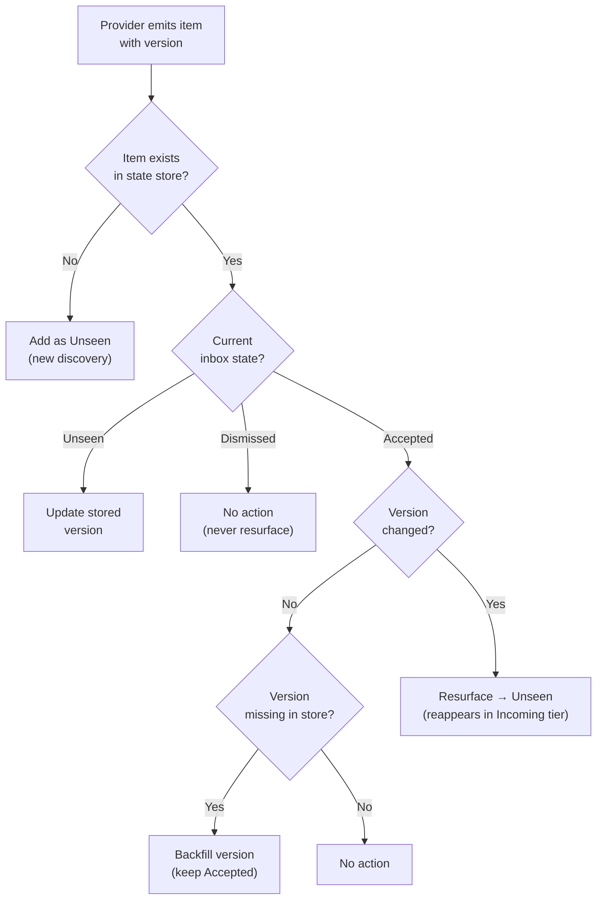

# Provider Discovery Conditions

This document explains what conditions cause work items and reviews to appear in DevDocket's **Incoming tier** and **Sources** tab. Each provider discovers items based on specific criteria — if an item meets those criteria, it shows up automatically.

## Table of Contents

- [Discovery Overview](#discovery-overview)
- [GitHub Issues](#github-issues)
- [GitHub Mentions](#github-mentions)
- [GitHub PR Reviews](#github-pr-reviews)
- [GitHub My PRs](#github-my-prs)
- [Azure DevOps Work Items](#azure-devops-work-items)
- [Azure DevOps PR Reviews](#azure-devops-pr-reviews)
- [Azure DevOps My PRs](#azure-devops-my-prs)
- [Common Behavior](#common-behavior)
  - [Refresh Intervals](#refresh-intervals)
  - [Item Lifecycle (Inbox States)](#item-lifecycle-inbox-states)
  - [Resurfacing](#resurfacing)
  - [Troubleshooting](#troubleshooting)

---

## Discovery Overview

The following diagram shows how items flow from external systems into DevDocket's tiers:

---

## GitHub Issues

**Provider:** DevDocket GitHub  
**Condition:** The issue is **assigned to you** and **open**.

An issue appears when **all** of the following are true:

| Condition | Details |
|-----------|---------|
| **Assigned to you** | You are listed as an assignee on the issue |
| **Open state** | The issue is not closed |
| **Not a pull request** | Only issues appear here, not PRs |
| **Repository match** | If `devDocketGithub.filteredRepos` is configured, the patterns listed there are **excluded** (with `!`-prefixed entries re-including matches). With no patterns set, assigned issues across all repositories are included. Each query (global or per-repo) is limited to 1,000 items due to pagination limits. |

### Configuration

| Setting | Default | Description |
|---------|---------|-------------|
| `devDocketGithub.filteredRepos` | `""` (no exclusions) | Newline-separated repo patterns to **exclude** from discovery. Supports glob and `!` re-include syntax. Leave empty to fetch issues across all repositories where you have assignments. |
| `devDocketGithub.refreshIntervalSeconds` | `300` (5 min) | How often to poll for changes. Minimum 60 seconds. |

### What does NOT cause issues to appear

- Being **mentioned** in an issue (only assignment counts)
- Being the **author** of an issue (unless also assigned)
- Issues you are **subscribed** to
- Issues with a specific **label** (there is no label filter)
- **Closed** issues, even if assigned to you

---

## GitHub Mentions

**Provider:** DevDocket GitHub
**Condition:** You are **@mentioned** on an issue or pull request **updated after** the first time the provider activated for your account.

A mention appears when **all** of the following are true:

| Condition | Details |
|-----------|---------|
| **Mentions you** | The issue or PR body or any of its comments contain `@your-username` |
| **Updated after first activation** | DevDocket records a timestamp the first time the GitHub Mentions provider runs and queries `mentions:@me updated:>{timestamp}`, so any item updated after that timestamp surfaces — including older threads that have been re-touched (new comment, edit, label change, etc.) |
| **Repository match** | If `devDocketGithub.filteredRepos` is configured, the patterns listed there are **excluded** (with `!`-prefixed entries re-including matches). With no patterns set, all mentions across repositories you can read are included. The GitHub Search API caps each query at 100 results. |

Items can be either issues or pull requests; the type pill in the UI reflects which one.

### Configuration

| Setting | Default | Description |
|---------|---------|-------------|
| `devdocketGithub.repos` | `[]` (all repos) | Same repo filter as GitHub Issues. |
| `devdocketGithub.refreshIntervalSeconds` | `300` (5 min) | Shared with GitHub Issues. |

### What does NOT cause mentions to appear

- Mentions in items **last updated before** the provider's first activation timestamp (the `updated:>` filter in the search query is the only time gate; original creation date does not matter).
- Mentions in **private repositories** you don't have access to.
- Notifications-style mentions on commits or other non-issue/non-PR objects.

---

## GitHub PR Reviews

**Provider:** DevDocket GitHub  
**Condition:** You have a **pending review request** on an **open** pull request.

A PR review appears when **all** of the following are true:

| Condition | Details |
|-----------|---------|
| **Review requested from you** | You are explicitly listed as a requested reviewer |
| **Open state** | The PR is not closed or merged |
| **Repository match** | If `devDocketGithub.filteredRepos` is configured, the patterns listed there are **excluded**. With no patterns set, review requests across all repositories are included. Each query (global or per-repo) is limited to 100 results due to GitHub Search API limits. |

### Configuration

| Setting | Default | Description |
|---------|---------|-------------|
| `devDocketGithub.filteredRepos` | `""` (no exclusions) | Same exclude-pattern filter as GitHub Issues. |
| `devDocketGithub.refreshIntervalSeconds` | `300` (5 min) | Shared with GitHub Issues. |
| `devDocketGithub.resurfaceOnNewVersion` | `true` | When enabled, a PR you've already accepted reappears in the Incoming tier if new commits are pushed. |
| `devDocketGithub.resurfaceOnReRequestedReview` | `true` | When enabled, a PR reappears if the author explicitly re-requests your review. |

### What does NOT cause PR reviews to appear

- Being **mentioned** in a PR
- Being **assigned** to a PR (only review requests count)
- Being the **author** of a PR
- PRs you have **already reviewed** (unless review is re-requested)
- **Closed** or **merged** PRs

---

## GitHub My PRs

**Provider:** DevDocket GitHub  
**Condition:** You are the **author** of an **open** pull request.

A PR appears when **all** of the following are true:

| Condition | Details |
|-----------|---------|
| **Authored by you** | You created the pull request |
| **Open state** | The PR is not closed or merged |
| **Repository match** | If `devDocketGithub.filteredRepos` is configured, the patterns listed there are **excluded**. With no patterns set, your authored PRs across all repositories are included. Each query (global or per-repo) is limited to 100 results due to GitHub Search API limits. |

Each discovered PR is enriched with its current status: Draft, Waiting on reviews, Review received, Changes requested, Approved, Ready to merge, or Open (fallback when detailed status cannot be determined).

### Configuration

| Setting | Default | Description |
|---------|---------|-------------|
| `devDocketGithub.filteredRepos` | `""` (no exclusions) | Same exclude-pattern filter as GitHub Issues. |
| `devDocketGithub.refreshIntervalSeconds` | `300` (5 min) | Shared with GitHub Issues. |

### What does NOT cause your PRs to appear

- PRs where you are a **reviewer** but not the author
- PRs you are **assigned** to but did not author
- **Closed** or **merged** PRs
- **Draft** PRs still appear (with "Draft" status)

---

## Azure DevOps Work Items

**Provider:** DevDocket — Azure DevOps  
**Condition:** The work item is **assigned to you** and in an **active state**.

A work item appears when **all** of the following are true:

| Condition | Details |
|-----------|---------|
| **Assigned to you** | You are the `Assigned To` user on the work item |
| **Not in a terminal state** | The work item is not in a state categorized as Completed, Removed, or Resolved |
| **Organization/project match** | Only work items from your configured organizations and projects appear |

### State filtering

ADO uses a two-layer filter to handle the variety of process templates (Agile, Scrum, CMMI, custom):

1. **First pass:** Excludes items with state names `Closed` or `Removed` (covers the most common cases)
2. **Second pass:** Checks each work item type's state definitions and excludes items whose state falls into a **terminal state category** (Completed, Removed, or Resolved)

This means items are correctly filtered regardless of your process template. For example, a Scrum "Done" item (category: Completed) is excluded even though its state name isn't "Closed".

> **Note:** State-category filtering is fail-open. If the Work Item Type States API call fails, only the first-pass name filter (`Closed`/`Removed`) applies, and items in other terminal states (e.g., `Done`) may still appear.

### Configuration

| Setting | Default | Description |
|---------|---------|-------------|
| `devdocketAdo.projects` | `[]` | Organizations and projects to monitor. Each entry is `<org>` (entire organization) or `<org>/<project>` (specific project). At least one entry is required for the ADO providers to discover items. |
| `devdocketAdo.refreshIntervalSeconds` | `300` (5 min) | How often to poll for changes. Minimum 60 seconds. Set to 0 or a negative value to disable. |

### What does NOT cause work items to appear

- Work items you **created** (unless also assigned to you)
- Work items where you are in the **activity** or **discussion** but not assigned
- Work items in **Closed**, **Done**, **Removed**, or other terminal states
- Work items from organizations/projects not listed in `devdocketAdo.projects`

---

## Azure DevOps PR Reviews

**Provider:** DevDocket — Azure DevOps  
**Condition:** You are a **reviewer** on an **active** pull request.

A PR review appears when **all** of the following are true:

| Condition | Details |
|-----------|---------|
| **You are a reviewer** | You are listed as a reviewer on the PR (required, optional, or any reviewer role) |
| **Active status** | The PR is not completed, abandoned, or in any other non-active state |
| **Organization/project match** | Only PRs from your configured organizations and projects appear |

### Configuration

| Setting | Default | Description |
|---------|---------|-------------|
| `devdocketAdo.projects` | `[]` | Same org/project filter as ADO Work Items. At least one entry is required. |
| `devdocketAdo.refreshIntervalSeconds` | `300` (5 min) | Shared with ADO Work Items. |
| `devdocketAdo.resurfaceOnNewVersion` | `true` | When enabled, a PR you've already accepted reappears in the Incoming tier if new iterations (commits) are pushed. Note: ADO does not support re-request-based resurfacing (unlike GitHub). |

### What does NOT cause ADO PR reviews to appear

- PRs you **created** (those surface via [Azure DevOps My PRs](#azure-devops-my-prs) instead, unless you're also added as a reviewer)
- PRs where you are only in a **comment thread**
- **Completed** or **abandoned** PRs

---

## Azure DevOps My PRs

**Provider:** DevDocket — Azure DevOps
**Condition:** You are the **creator** of an **active** pull request.

A PR appears when **all** of the following are true:

| Condition | Details |
|-----------|---------|
| **Authored by you** | You are the creator of the PR |
| **Active status** | The PR is not completed or abandoned |
| **Organization/project match** | Only PRs from your configured organizations and projects appear |

Each discovered PR is enriched with its current vote-derived status (Draft, Waiting on reviews, Review in progress, Approved, Waiting for author, or Rejected). The status surfaces as a state badge in the editor.

### Configuration

| Setting | Default | Description |
|---------|---------|-------------|
| `devdocketAdo.projects` | `[]` | Same org/project filter as ADO Work Items. At least one entry is required. |
| `devdocketAdo.refreshIntervalSeconds` | `300` (5 min) | Shared with ADO Work Items. |

### What does NOT cause your PRs to appear

- PRs created by **other people**, even if you are a reviewer (those surface via [Azure DevOps PR Reviews](#azure-devops-pr-reviews) instead)
- **Completed** or **abandoned** PRs
- **Draft** PRs still appear (with `Draft` status)

---

## Common Behavior

### Refresh Intervals

All providers poll their data source periodically. The default interval is **5 minutes** (300 seconds).

- **Minimum:** 60 seconds (values below 60 are automatically clamped to 60)
- **Disable:** Set the interval to `0` or a negative value to stop automatic polling
- **Manual refresh:** You can always trigger a refresh manually via the DevDocket refresh command, regardless of the interval setting

### Item Lifecycle (Inbox States)

When a provider discovers an item, it enters the **Incoming tier** as an unseen item. From there:

- **Unseen** — New item in the Incoming tier, waiting for you to triage it.
- **Accepted** — You've accepted the item; it becomes a work item in the **Ready to Start** tier (or in **In Progress** if you used the Start hover action).
- **Dismissed** — You've dismissed the item. It will **not** reappear in the Incoming tier, even if the provider keeps discovering it. Dismissed items remain visible in the Sources tab.

### Resurfacing

Some providers track **versions** of discovered items. When a version changes on an item you previously accepted, the item is moved back to **Unseen** so it reappears in the Incoming tier. This lets you know something has changed.

**GitHub PR Reviews** support two independent resurfacing signals:

| Signal | Tracked via | Setting |
|--------|-------------|---------|
| New commits pushed to the PR | HEAD commit SHA | `devDocketGithub.resurfaceOnNewVersion` |
| Review explicitly re-requested | Timeline event timestamp | `devDocketGithub.resurfaceOnReRequestedReview` |

> **Note:** Re-request detection is best-effort. Only the first page of PR timeline events (up to 100) is checked, so on PRs with extensive activity the latest re-request event may be missed.

**Azure DevOps PR Reviews** support one resurfacing signal:

| Signal | Tracked via | Setting |
|--------|-------------|---------|
| New iterations pushed to the PR | Last merge source commit ID | `devDocketAdo.resurfaceOnNewVersion` |

**Dismissed items are never resurfaced.** Only accepted items can be resurfaced by version changes.

### Troubleshooting

**Items not appearing?** Check these common causes:

1. **Not authenticated** — Ensure you're signed into GitHub or Microsoft in VS Code. DevDocket uses VS Code's built-in authentication. Background refreshes won't prompt for sign-in; trigger a manual refresh to get the auth prompt.
2. **Wrong repository/project config** — For GitHub, the `devDocketGithub.filteredRepos` setting **excludes** the patterns you list (so leaving it empty includes everything you have access to). For ADO, at least one entry in `devDocketAdo.projects` is required — an empty list disables ADO discovery entirely.
3. **Invalid format** — GitHub `filteredRepos` patterns are matched as globs against `owner/repo`; entries that fail to parse are logged as warnings and skipped. ADO entries must be `org` or `org/project`; individual malformed entries are silently skipped, but if all entries are invalid the ADO providers will not activate.
4. **Item already dismissed** — Dismissed items never reappear. Check the Sources tab to see all items the provider knows about, regardless of inbox state.
5. **Terminal state** — ADO work items in Closed, Done, Removed, or other terminal states are excluded.
6. **Provider unhealthy** — Check the Sources tab for providers showing a `⚠` warning indicator. This indicates an authentication or network issue.
7. **Item limit** — Each provider is limited to 10,000 discovered items per refresh. If a provider emits more than 10,000 items, only the first 10,000 are kept and a warning is logged.

**Items appearing unexpectedly?**

1. **Resurfacing** — An accepted PR review may reappear if new commits were pushed or a review was re-requested. Disable this via the `resurfaceOnNewVersion` or `resurfaceOnReRequestedReview` settings.
2. **Repository scope** — `devDocketGithub.filteredRepos` is an **exclude** list, so leaving it empty includes every repository you can read. Add repository patterns to scope discovery down.
