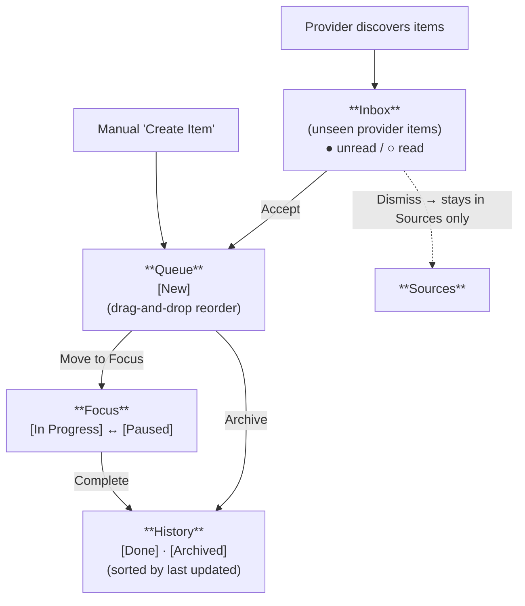

# WorkCenter UX Guide

WorkCenter is a VS Code extension that provides a unified hub for managing work items from multiple sources. This guide covers the five-view model, data flow, available actions, and provider configuration.

## The Five Views

WorkCenter organizes work across five views, accessible from the WorkCenter activity bar icon.

### Inbox

The Inbox shows newly discovered items from providers that you haven't acted on yet. Items appear here automatically when a provider (such as GitHub Issues or Azure DevOps) discovers them.

Each provider's items are grouped under the provider name with a count of unseen items. Items from the same provider may also be grouped by sub-group (e.g., repository name). Only providers with unseen items appear in the Inbox.

**Read/unread tracking:** Inbox items track whether you've viewed them. Unread items show a filled circle icon (●) and read items show an outline circle (○). Clicking an item marks it as read. Read state is persisted across VS Code restarts.

**Badge:** The Inbox view displays a badge on its tab showing the count of unseen items that you haven't clicked on yet.

**Notifications:** When new items arrive in the Inbox, a notification appears with a **Show Inbox** button. This can be disabled via the `workcenter.showInboxNotifications` setting.

**Available actions on Inbox items:**

| Action | Description |
|--------|-------------|
| **Accept to Queue** | If not already accepted, creates a work item in the Queue and marks the provider item as accepted; if already accepted, shows a notification and does not change its state |
| **Dismiss** | Hides the item from the Inbox (it remains visible in Sources) |
| **Open in Browser** | Opens the item's URL in your default browser (if the item has a URL) |

### Queue

The Queue is your curated backlog — items you've decided to work on but haven't started yet. Items arrive here in two ways:

1. **Accepted from Inbox or Sources** — provider-discovered items you've chosen to keep.
2. **Manually created** — items you add yourself using the **Create Work Item** button (➕) in the Queue title bar.

All items in the Queue are in the **New** state. Items are sorted by their sort order (the order you've arranged them in).

Clicking a Queue item opens the editor panel for that item.

**Reordering:** You can reorder Queue items by **drag-and-drop** or by using the **Move Up** / **Move Down** context menu commands. Drag an item onto another to insert it at that position.

**Available actions on Queue items:**

| Action | Description |
|--------|-------------|
| **Move to Focus** | Transitions the item to **In Progress** and moves it to the Focus view (inline button) |
| **Archive** | Transitions the item to **Archived**, removing it from the Queue |
| **Move Up / Move Down** | Reorders the item within the Queue |
| **Run Action…** | Shows available provider actions for this item |
| **Open in Browser** | Opens the item's URL in your default browser (if the item has a URL) |

### Focus

The Focus view shows items you are actively working on. Items here can be in one of two states: **In Progress** or **Paused**.

Items display a state label next to the title, with icons indicating status:
- **in progress** — actively being worked on (shown with a ▶ play-circle icon)
- **paused** — work is temporarily on hold (shown with a pause icon)

Clicking a Focus item opens the editor panel for that item.

**Available actions on Focus items:**

| Action | Description |
|--------|-------------|
| **Complete** | Transitions the item to **Done** and moves it to History (inline button) |
| **Pause** | Transitions an active (in progress) item to **Paused** |
| **Resume** | Transitions a paused item back to **In Progress** |
| **Run Action…** | Shows available provider actions for this item |
| **Open in Browser** | Opens the item's URL in your default browser (if the item has a URL) |

> **Note:** The **Pause** action is only available on active (in progress) items. The **Resume** action is only available on paused items.

### Sources

Sources is a browsable library of everything providers know about, regardless of inbox state. Items are organized in a tree: **Provider → Group → Item**.

- Providers appear at the top level.
- Groups (e.g., repository names) appear as folders under each provider.
- Ungrouped items appear directly under their provider.
- Items show a ✓ icon if already accepted, and a "dismissed" label if previously dismissed.

**Available actions on Source items:**

| Action | Description |
|--------|-------------|
| **Accept to Queue** | If not already accepted, creates a work item in the Queue and marks the provider item as accepted; if already accepted, shows a notification and does not change its state |
| **Open in Browser** | Opens the item's URL in your default browser (if the item has a URL) |

### History

The History view shows completed and archived items, sorted by most recently updated (newest first). This provides a record of past work without cluttering the active views.

Items display a state label next to the title:
- **done** — work that was completed (shown with a check icon)
- **archived** — items that were archived (shown with an archive icon)

Clicking a History item opens the editor panel to view its details.

**Available actions on History items:**

| Action | Description |
|--------|-------------|
| **Open in Browser** | Opens the item's URL in your default browser (if the item has a URL) |

> **Note:** History items are in terminal states, so no state-changing commands are available.

## Data Flow

Items flow through WorkCenter in a defined progression:

**Sources** sits alongside this flow as a read-only view of all provider data. You can accept items from Sources into the Queue at any time.

## Manual Item Creation

To create a work item manually:

1. Open the **Queue** view in the WorkCenter sidebar.
2. Click the **➕** (Create Work Item) button in the Queue title bar.
3. Enter a title in the input box (required).
4. The item appears in the Queue in the **New** state.

Manually created items exist only within WorkCenter — they aren't linked to any provider.

## Editor Panel

Clicking an item in Queue, Focus, or History opens a webview-based editor panel with two fields:

- **Title** — A single-line text input (required). For provider-backed items, the title is read-only.
- **Notes** — A multi-line textarea for additional notes.

The editor **auto-saves** as you type — there is no save button. The panel title updates to reflect the current item title.

## Providers

WorkCenter supports multiple provider extensions that discover work items from external systems. Each provider is a separate VS Code extension that depends on the core WorkCenter extension.

### GitHub Provider (`workcenter-github`)

Discovers items from GitHub via two sub-providers:

- **GitHub Issues** — Finds issues assigned to you across configured repositories.
- **GitHub PR Reviews** — Finds pull requests where you've been requested as a reviewer. Previously dismissed review requests will reappear if the PR is still active.

**Actions:**
- **Start Git Work (Branch + Worktree)** — Available on **InProgress** GitHub and ADO work items. Prompts for repository path and base branch (with cached defaults), creates a feature branch named `issue{num}`, sets up a git worktree in a sibling directory, and runs any configured post-worktree commands.

**Configuration:**

| Setting | Type | Default | Description |
|---------|------|---------|-------------|
| `workcenterGithub.repos` | `string[]` | `[]` | GitHub repositories to watch (e.g., `owner/repo`). Leave empty to fetch all assigned issues across all repositories. |
| `workcenterGithub.refreshIntervalSeconds` | `number` | `300` | How often to refresh GitHub data (in seconds). Minimum 60 seconds; values below 60 are clamped. |

### Azure DevOps Provider (`workcenter-ado`)

Discovers items from Azure DevOps via two sub-providers:

- **ADO Work Items** — Finds work items assigned to you.
- **ADO PR Reviews** — Finds pull requests where you've been requested as a reviewer.

**Configuration:**

| Setting | Type | Default | Description |
|---------|------|---------|-------------|
| `workcenterAdo.organization` | `string` | `""` | Azure DevOps organization name (required to enable the provider). |
| `workcenterAdo.projects` | `string[]` | `[]` | Projects to monitor. Leave empty to fetch across the entire organization. |
| `workcenterAdo.refreshIntervalSeconds` | `number` | `300` | How often to refresh ADO data (in seconds). Minimum 60 seconds; set to 0 or negative to disable periodic refresh. |

### AI Code Review (`workcenter-ai-reviewer`)

Registers an **AI Code Review** action that can be run on any work item whose URL points to a GitHub pull request. When triggered via **Run Action…**, it fetches the PR diff and sends it to a VS Code language model for review.

**Configuration:**

| Setting | Type | Default | Description |
|---------|------|---------|-------------|
| `workcenterAiReview.customPromptPath` | `string` | `""` | Path to a custom code review prompt file. Replaces the built-in review instructions. The PR diff is always appended automatically. Supports absolute paths and workspace-relative paths. |

## Core Configuration

| Setting | Type | Default | Description |
|---------|------|---------|-------------|
| `workcenter.logLevel` | `string` | `"info"` | Log level for the WorkCenter output channel. Valid values: `debug`, `info`, `warn`, `error`. |
| `workcenter.showInboxNotifications` | `boolean` | `true` | Show a notification when new items arrive in the Inbox. |

## Keyboard Shortcuts

WorkCenter provides chorded keyboard shortcuts using the **Ctrl+Alt+D** prefix. All shortcuts are scoped to WorkCenter views — they only activate when a WorkCenter view has focus.

To use a shortcut, press **Ctrl+Alt+D**, release, then press the second key.

| Shortcut | Action | Description |
|----------|--------|-------------|
| `Ctrl+Alt+D`, `N` | Create Work Item | Opens the input box to create a new item in the Queue |
| `Ctrl+Alt+D`, `D` | Complete Item | Marks the focused item as **Done** and moves it to History |
| `Ctrl+Alt+D`, `P` | Pause Item | Pauses an active (in progress) item in Focus |
| `Ctrl+Alt+D`, `U` | Resume Item | Resumes a paused item in Focus |
| `Ctrl+Alt+D`, `F` | Accept to Focus | Accepts an Inbox item directly to Focus (skipping Queue) |
| `Ctrl+Alt+D`, `Q` | Move to Queue | Moves an item to the Queue |
| `Ctrl+Alt+D`, `R` | Refresh | Refreshes all provider data |
