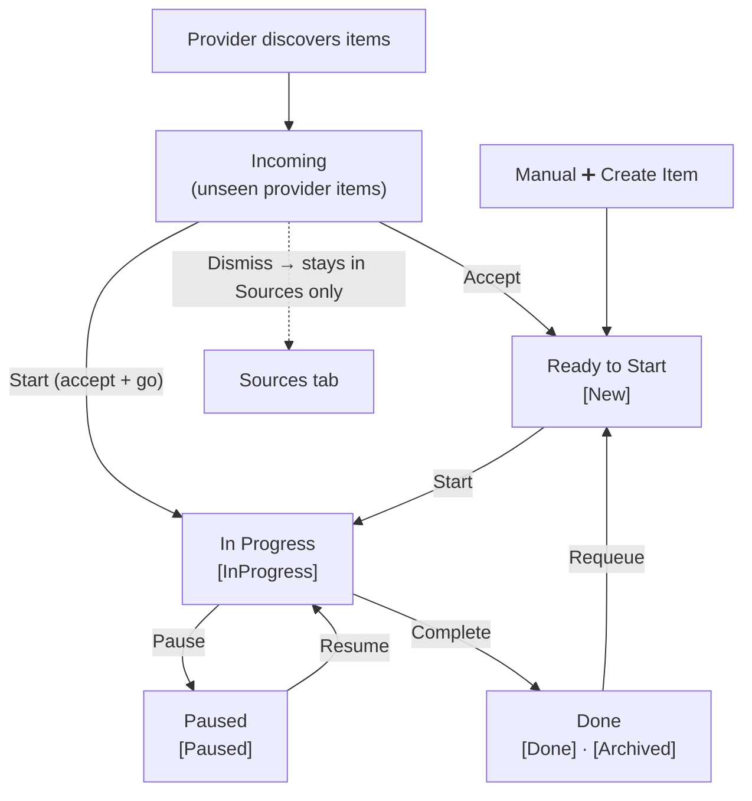

# DevDocket UX Guide

DevDocket is a VS Code extension that provides a unified hub for managing work items from multiple sources. This guide covers the sidebar layout, item lifecycle, available actions, and configuration.

## The DevDocket Sidebar

DevDocket adds a single view to its activity-bar container — a Preact-based webview with two tabs: **My Work** and **Sources**. A separate floating **CI Watches** panel is opened from the status bar.

### My Work tab

Your active workflow, organized into five tiers in this render order:

| Tier | What's in it |
|------|--------------|
| **↓ Incoming** | Newly discovered provider items you haven't triaged. |
| **▶ In Progress** | What you're actively working on. |
| **○ Ready to Start** | Your curated backlog of accepted items + manual tasks. |
| **⏸ Paused** | Items you've temporarily set aside. |
| **✓ Done** | Completed and archived items. |

Tiers with no items are hidden. The Done tier collapses by default.

#### Click behavior

- **Incoming items**: clicking an item opens it in a read-only **preview panel** (the same UI as the editor) so you can decide whether to accept or dismiss without committing. The blue unread dot disappears once you've clicked.
- **All other tiers**: clicking opens the regular editor for that work item.

#### Hover actions (item cards)

Each tier exposes a small floating action overlay on hover. Available actions per tier:

| Tier | Hover actions |
|------|---------------|
| Incoming | **✓ Accept**, **▶ Start** (accept + go to In Progress), **✗ Dismiss** |
| In Progress | **✓ Complete**, **⏸ Pause** |
| Ready to Start | **▶ Start** |
| Paused | **▶ Resume** |
| Done | **↩ Requeue** |

The drag handle (left side of the card) appears on hover for tiers that support reordering: Ready to Start and In Progress. Drag a card up or down to change its priority within that tier.

#### Tier header actions

- **Incoming** has an **Accept All** button.
- **Done** has a **Clear** button (clears items older than `devDocket.historyClearDays`).
- All tiers can be collapsed by clicking the chevron on the right.

#### Item card content

Each card shows:

- **Title** (with a blue dot prefix for unread Incoming items)
- **Repo annotation** (diminished text below the title) — typically `owner/repo` for provider items
- **Badges** — Provider (GitHub / ADO / Manual), Type (Issue / PR), provider-declared badges (e.g. `Mentioned`, `Review requested`, `Approved`), and CI badges (`CI passed` / `CI failed`) when a watcher is active for the item

### Sources tab

A browsable library of everything providers know about, organized as **Provider → Group → Item** (group is typically a repo name).

- Items show a `✓` if already accepted into the workflow, or a `dismissed` label if previously dismissed.
- Clicking an item opens it: in the regular editor if it's been accepted, or in the read-only preview panel otherwise.
- Unhealthy providers display a `⚠` warning icon next to the provider name.

### Editor panel

Clicking a non-incoming work item opens the editor in a tab. It contains:

- A **header** with the item title (clickable for provider items — opens the source URL), inline copy-title and copy-URL buttons, the **state-dependent transition buttons** offered by the editor (Start / Pause / Resume / Complete / Requeue / Archive — only the ones valid for the current state are shown), the **Run Action…** button when at least one registered action declares `canRun(item) === true`, and badges for provider, type, and provider-supplied state.
- A **Description** section (markdown-rendered) for provider items, when one is present.
- A **Notes** section (auto-saving textarea) for your own notes — hidden when previewing an unaccepted incoming item.
- A collapsible **Activity Log** that records every state transition, action invocation, version change, etc.

The editor auto-saves as you type — there is no save button.

### Incoming preview panel

A read-only variant of the editor used when you click an Incoming item or an unaccepted Sources item. It shows the same header / description but exposes only **Accept**, **Dismiss**, and **Open in Browser** actions in the header, plus no Notes section. The panel closes automatically when you Accept (replaced by the regular editor) or Dismiss.

## CI Watches Panel

A floating webview that monitors GitHub Actions / Azure DevOps Pipeline runs and pull request lifecycle status (open / merged / closed). Open it from the **eye icon** in the status bar — the icon shows the current watch count and turns amber when a watched run fails.

### Two sections

- **PR Watches** — pull requests being monitored, with each PR's CI runs flattened beneath it (the PR card and its run cards appear adjacent in the list).
- **Run Watches** — standalone pipeline runs you've added directly.

### Adding watches

- Inside the panel, click **+ Watch URL** in the header. Paste either a pipeline run URL or a pull request URL — DevDocket detects which kind it is.
- From the command palette: **DevDocket: Watch Pipeline Run** or **DevDocket: Watch Pull Request**.
- GitHub PRs you authored can be auto-watched on discovery — see `devDocket.watches.autoWatchAuthoredPRs`.

The manual Watch URL flow is **idempotent** for already-watched URLs and force-recreates the watch when a PR is in a bad state (e.g. all child runs were dismissed making it invisible).

### Dismissing watches

- Hover any watch card and click the **✗** button.
- **Dismiss Completed** in the panel header clears all merged / closed PRs and finished runs in one click.

### Status bar

DevDocket contributes two right-aligned status bar items (priorities `100000` and `100001`, immediately to the left of the Copilot button). Quick access to the sidebar itself is via the activity-bar container, not the status bar.

- **Provider Health** (priority `100000`) — `⚠ N providers unhealthy`. Hidden when every provider is healthy, so the status bar stays quiet by default; click to open the Provider Health quick pick.
- **Watches** (priority `100001`) — eye icon + run counts (`🔄 N active · ✓ N passed · ✗ N failed`); always visible. Turns amber when at least one watched run has failed and the failure has not yet been acknowledged. Click to open the CI Watches panel.

## Item Lifecycle

Items flow through DevDocket like this:



**Sources** sits alongside this flow as a read-only library of everything providers know about. You can accept items from Sources into the workflow at any time.

## Manual Item Creation

To create a work item manually:

1. Click the **➕** (Create Work Item) button in the sidebar header.
2. Enter a title in the input box (required).
3. The item appears in the **Ready to Start** tier in the **New** state.

Manually created items exist only within DevDocket — they aren't linked to any provider.

## Auto-Completion

DevDocket can automatically mark work items as **Done** when their linked external item is closed, merged, or otherwise completed by the provider. This happens after each provider refresh — no manual intervention needed.

```jsonc
// settings.json
{
  "devDocket.autoCompleteOnClose": true  // default: true
}
```

Set to `false` to disable. Items in **Done** can be moved back to **Ready to Start** with the **↩ Requeue** hover action — useful for recovering from false positives.

## Providers

DevDocket supports multiple provider extensions that discover work items from external systems. Each provider is a separate VS Code extension that depends on the core DevDocket extension. For details on what causes items to surface in the Incoming tier, see [Provider Discovery](provider-discovery.md).

### GitHub Provider (`devdocket-github`)

Discovers items from GitHub via these sub-providers:

- **GitHub Issues** — Finds issues assigned to you across configured repositories.
- **GitHub Mentions** — Finds issues and PRs that mention you.
- **GitHub PR Reviews** — Finds pull requests where you've been requested as a reviewer. Previously seen PR reviews can resurface when new commits are pushed or when review is explicitly re-requested (controlled by `resurfaceOnNewVersion` and `resurfaceOnReRequestedReview`).
- **GitHub My PRs** — Finds pull requests you authored or are assigned to, with computed status badges (Draft, Approved, Changes requested, Ready to merge, etc.).

**Configuration:**

| Setting | Type | Default | Description |
|---------|------|---------|-------------|
| `devDocketGithub.filteredRepos` | `string` | `""` | Newline-separated repo patterns to **exclude** from discovery in both the Incoming tier and Sources tab (e.g. `org/private-repo`). Supports glob patterns and `!` re-include. Leave empty to fetch all relevant items across all repositories you can read. |
| `devDocketGithub.refreshIntervalSeconds` | `number` | `300` | How often to refresh GitHub data (in seconds). Minimum 60 seconds; values below 60 are clamped. |
| `devDocketGithub.resurfaceOnNewVersion` | `boolean` | `true` | Resurface PR reviews when new commits are pushed. |
| `devDocketGithub.resurfaceOnReRequestedReview` | `boolean` | `true` | Resurface PR reviews when review is explicitly re-requested. |

### Azure DevOps Provider (`devdocket-ado`)

Discovers items from Azure DevOps via these sub-providers:

- **ADO Work Items** — Finds work items assigned to you, with their `System.State` shown as a badge in the editor.
- **ADO PR Reviews** — Finds pull requests where you've been requested as a direct reviewer or through an Azure DevOps group/team reviewer assignment.
- **ADO My PRs** — Finds pull requests you authored, with vote-derived status badges in the editor (Approved, Rejected, Waiting for author, etc.).

**Configuration:**

| Setting | Type | Default | Description |
|---------|------|---------|-------------|
| `devDocketAdo.projects` | `string[]` | `[]` | Organizations and projects to monitor. Use `<org>` to monitor an entire organization, or `<org>/<project>` for specific projects. |
| `devDocketAdo.refreshIntervalSeconds` | `number` | `300` | How often to refresh ADO data (in seconds). Minimum 60 seconds; set to 0 or negative to disable periodic refresh. |
| `devDocketAdo.resurfaceOnNewVersion` | `boolean` | `true` | Resurface PR reviews when new iterations are pushed. |

### AI Code Review (`devdocket-ai-reviewer`)

Registers an **AI Code Review** action that can be run on any work item whose URL points to a GitHub pull request. When triggered via **Run Action…** from the work item editor, it fetches the PR diff and sends it to a VS Code language model for review.

**Configuration:**

| Setting | Type | Default | Description |
|---------|------|---------|-------------|
| `devDocketAiReview.customPromptPath` | `string` | `""` | Path to a custom code review prompt file. Replaces the built-in review instructions. The PR diff is always appended automatically. Supports absolute paths and workspace-relative paths. |

### Start Git Work (`devdocket-start-git-work`)

Registers a **Start Git Work** action available on **In Progress** GitHub and ADO work items. Prompts for repository path and base branch (with cached defaults), creates a feature branch named `issue{num}`, sets up a git worktree in a sibling directory, and runs any configured post-worktree commands.

```jsonc
// settings.json (user-level only — workspace settings are not supported)
{
  "devDocketStartGitWork.commands": [
    { "command": "code.cmd", "args": ["{path}"] },
    { "command": "wt", "args": ["-d", "{path}"] }
  ]
}
```

Use `{path}` in args as a placeholder for the worktree path. Commands run in sequence; failures show a warning but don't block the action.

> **Note:** On Windows, use the explicit `.cmd` extension for executables that are batch files (e.g., `code.cmd` instead of `code`).

## Core Configuration

| Setting | Type | Default | Description |
|---------|------|---------|-------------|
| `devDocket.logLevel` | `string` | `"info"` | Log level for the DevDocket output channel. Valid values: `debug`, `info`, `warn`, `error`. |
| `devDocket.showInboxNotifications` | `boolean` | `true` | Show a notification when new items arrive in the Incoming tier. |
| `devDocket.autoCompleteOnClose` | `boolean` | `true` | Automatically mark work items as Done when their linked external item is closed, merged, or otherwise completed by the provider. |
| `devDocket.historyClearDays` | `integer` | `30` | Age threshold in days for the **Clear** action on the Done tier. Items in Done whose last modification is older than this many days are removed. Minimum: 1. |
| `devDocket.watches.autoWatchAuthoredPRs` | `boolean` | `true` | Automatically watch GitHub PRs you authored as the GitHub provider discovers them. |
| `devDocket.watches.pollingIntervalSeconds` | `number` | `60` | How often the watcher polls active CI runs and PRs. Minimum 15 seconds. |
| `devDocket.watches.notifyOnJobFailure` | `boolean` | `true` | Show a notification when an individual job fails while the pipeline run is still in progress. |

## Keyboard Shortcuts

DevDocket provides chorded keyboard shortcuts using the **Ctrl+Alt+D** prefix. All shortcuts are scoped to the DevDocket sidebar — they only activate when the sidebar has focus.

To use a shortcut, press **Ctrl+Alt+D**, release, then press the second key.

| Shortcut | Action | Description |
|----------|--------|-------------|
| `Ctrl+Alt+D`, `N` | Create Work Item | Opens the input box to create a new item in **Ready to Start** |
| `Ctrl+Alt+D`, `D` | Complete Item | Marks the focused item as **Done** |
| `Ctrl+Alt+D`, `P` | Pause Item | Pauses an item in **In Progress** |
| `Ctrl+Alt+D`, `U` | Resume Item | Resumes an item in **Paused** |
| `Ctrl+Alt+D`, `F` | Start (move to In Progress) | Moves the selected item to **In Progress** |
| `Ctrl+Alt+D`, `Q` | Requeue | Moves an item back to **Ready to Start** |
| `Ctrl+Alt+D`, `R` | Refresh | Refreshes all provider data |
